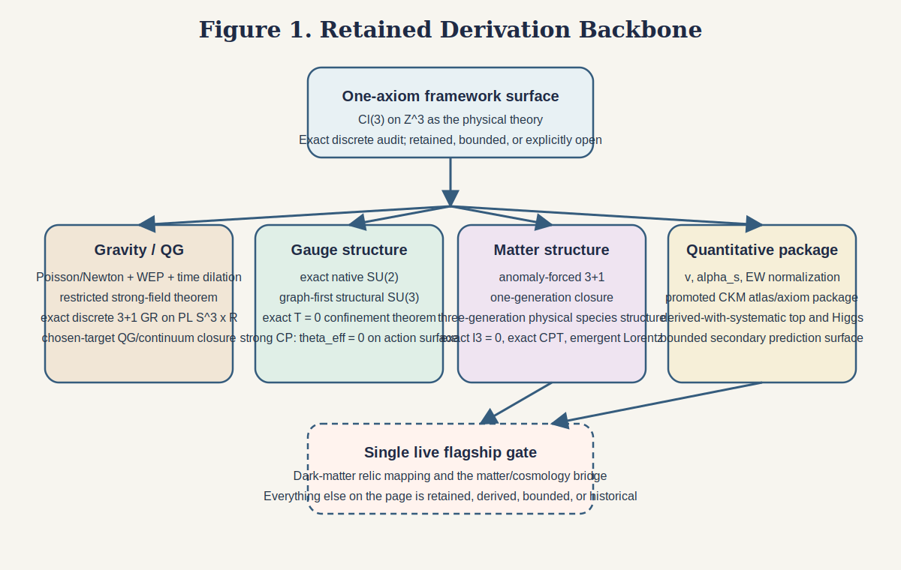
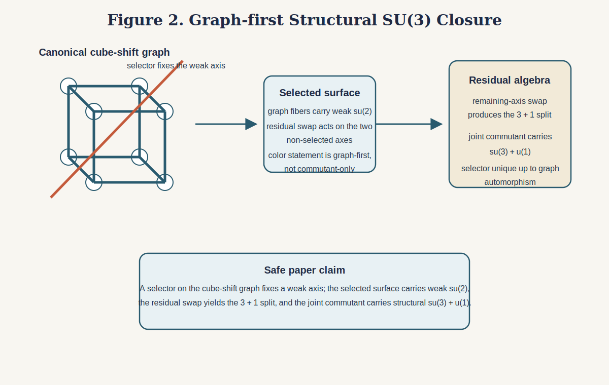
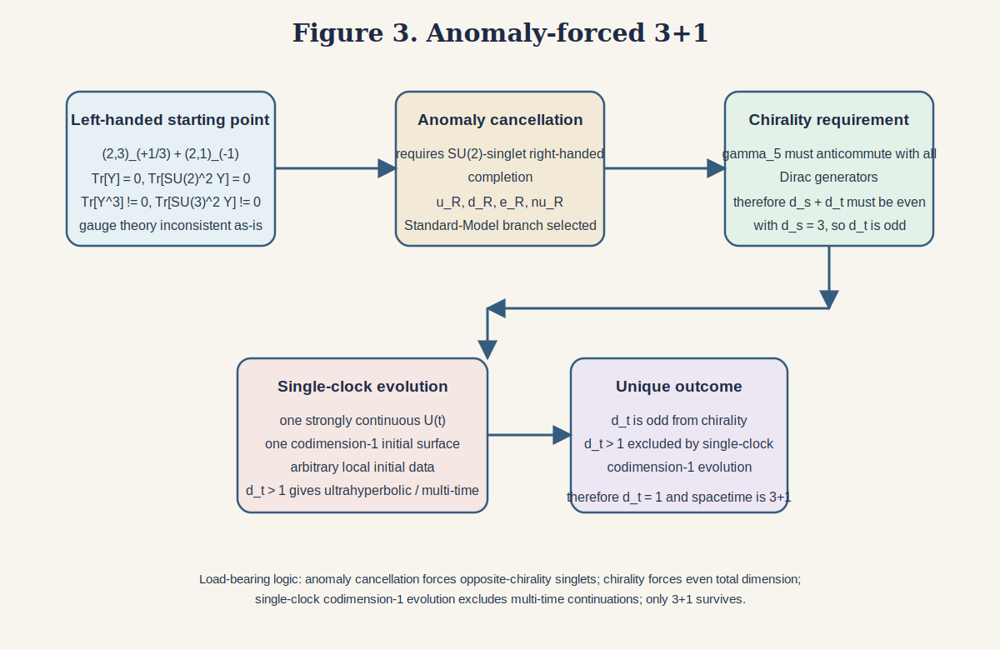
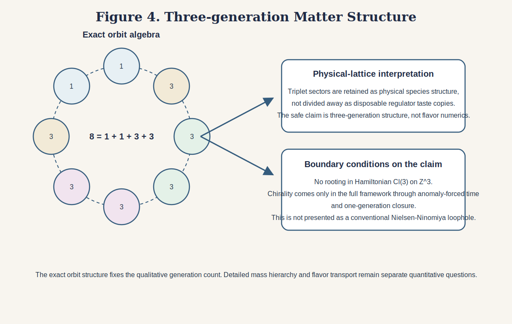
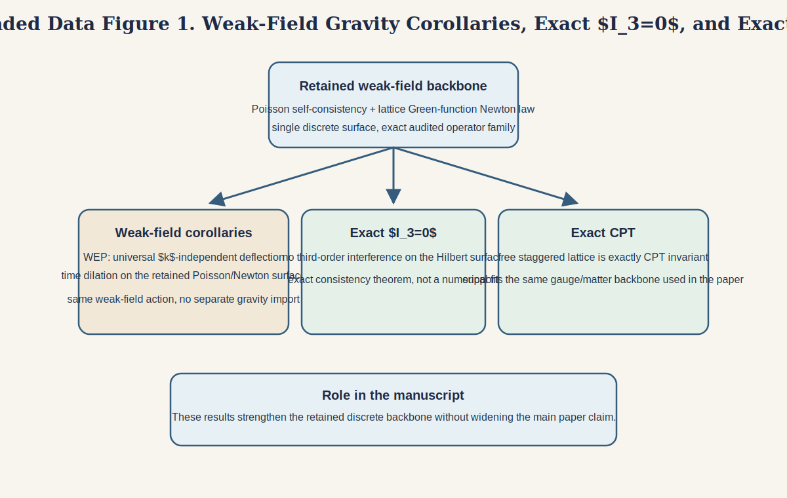
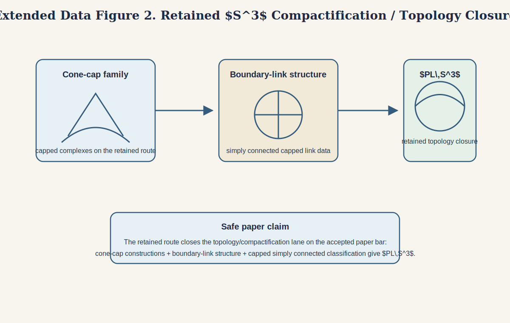
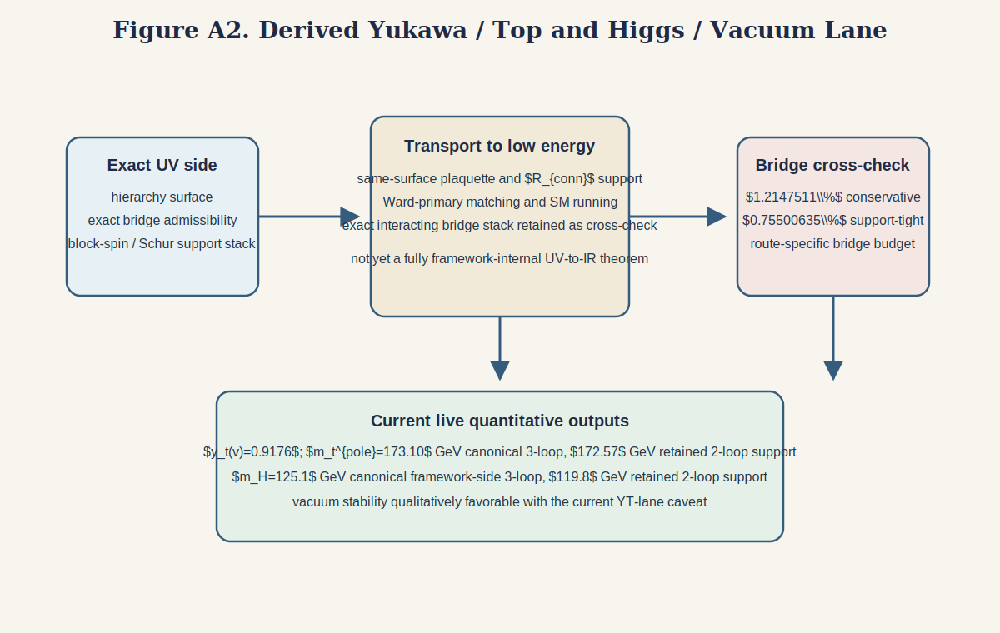
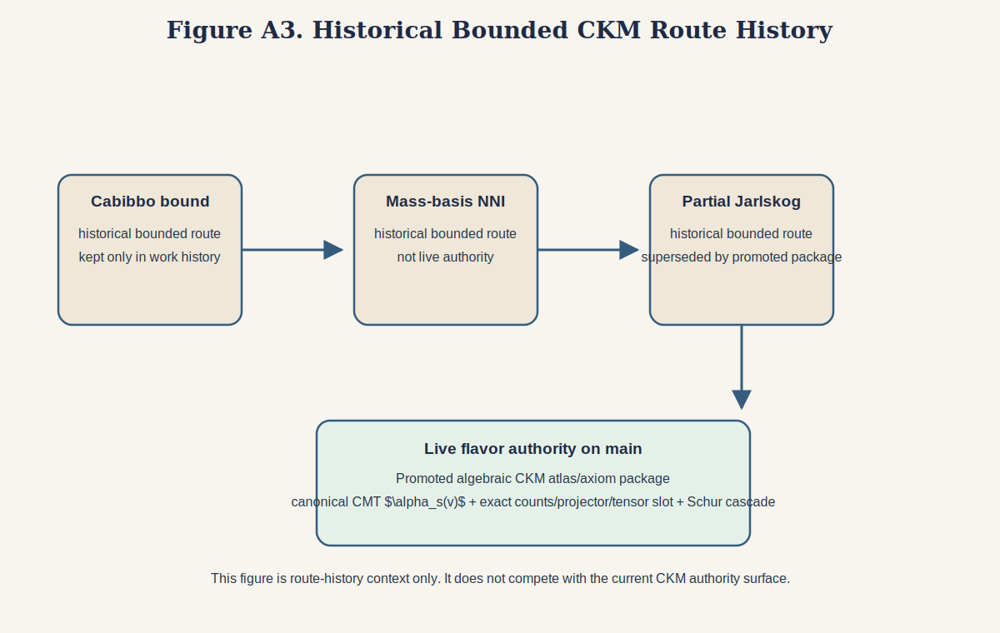

# Physics from $Cl(3)$ on $Z^3$:
# discrete $3+1$ gravity, gauge structure, matter closure, and quantitative tests

**Jonathon Reilly**

Contact: `jonathonreilly@gmail.com`

Public arXiv-first draft, April 15, 2026

Keywords: discrete gravity, lattice gauge theory, Clifford algebra, CKM, strong CP, confinement

## Abstract

We ask whether $Cl(3)$ on the cubic lattice $Z^3$ can be treated as the
physical theory rather than as a temporary regulator, and we retain only those
rows that survive direct audit on that exact discrete surface. The retained
core is already broad. On the gravity side, the framework yields Poisson/Newton
weak-field gravity, a restricted strong-field closure on an exact finite-rank
class, exact full discrete $3+1$ Einstein-Regge gravity on
$PL\,S^3 \times \mathbb{R}$, and an exact quantum-gravity/continuum
identification chain on one chosen canonical textbook target. On the gauge and
matter side, the same framework carries exact native $SU(2)$, graph-first
structural $SU(3)$, anomaly-forced $3+1$, retained three-generation matter
structure, exact $I_3=0$, exact CPT, emergent Lorentz invariance, exact strong
CP in the form $\theta_{\mathrm{eff}}=0$ on the retained action surface, and
exact $T=0$ confinement with bounded $\sqrt{\sigma}\approx 465\,\mathrm{MeV}$.
Quantitatively, the current package gives the canonical hierarchy evaluation
$v=246.282818290129\,\mathrm{GeV}$, retains
$\alpha_s(M_Z)=0.1181$ and electroweak normalization lanes, promotes an
algebraic CKM atlas/axiom closure package with no quark-mass or fitted-CKM
inputs, and carries Yukawa/top and Higgs/vacuum rows with explicit inherited
systematics. The package is already predictive beyond retrospective comparison,
including proton lifetime, CKM neutron EDM, vacuum criticality, and benchmark
gravitational decoherence. Dark-matter relic mapping is the sole remaining live
flagship gate. The paper separates exact, promoted, bounded, and open rows and
pairs them with a public reproducibility surface.

## 1. Introduction

The central question of this paper is not whether a discrete framework can
imitate isolated pieces of known physics, but whether one exact discrete
surface can carry a nontrivial fraction of gravity, gauge structure, matter,
and quantitative phenomenology without being treated as disposable
scaffolding. We take that question literally. The framework is $Cl(3)$ on
$Z^3$, treated as physical rather than as a regulator, and we retain only those
rows that survive direct audit on that exact surface.

Ambitious unification programs often fail less because a local mechanism is
missing than because claim boundaries dissolve: structural theorems, numerical
lanes, and open bridges are mixed together until it is no longer clear what
has actually been shown. This paper takes the opposite approach. Every row is
explicitly retained, bounded, or open.

The framework sentence is therefore simple:

> We take $Cl(3)$ on $Z^3$ as the physical theory. Everything else in this
> paper is either retained, bounded, or explicitly open.

That sentence is stronger than a regulator interpretation and narrower than a
blanket statement that every phenomenological sector has closed. The lattice is
not temporary scaffolding for a different continuum theory; it is the exact
surface on which the audit is performed. The paper asks what survives on that
surface and keeps only those rows.

Several shifts make the present manuscript different from earlier states of the
program. The direct-universal gravity route now closes as exact full discrete
$3+1$ general relativity on the project route. The QG/continuum chain closes on
one chosen canonical textbook target; that is a chosen-target identification
theorem, not a blanket claim about every possible continuum completion. Strong
CP is exact on the retained action surface. Confinement is promoted as an exact
structural theorem with a bounded string-tension readout. CKM is promoted as a
canonical atlas/tensor closure package with canonical CMT $\alpha_s(v)$ input
and no quark-mass or fitted-CKM derivation inputs. The package is already
predictive beyond the theorem spine: it carries bounded secondary predictions,
not only retrospective matches. The only live flagship gate left is dark matter
relic mapping.

The right reading of the manuscript is therefore no longer “promising
framework with many open bridges.” It is “one discrete framework that already
supports a broad exact backbone, a promoted quantitative stack, a bounded but
real prediction surface, and one clearly identified flagship gate.”

## 2. Framework, Inputs, and Claim Boundary

The retained framework surface has four layers:

1. retained theorem core;
2. retained standalone quantitative lanes;
3. bounded quantitative and secondary prediction lanes;
4. one live flagship gate.

The point of that split is methodological. Exact and promoted rows belong in
the main derivation spine. Bounded rows belong in explicitly labeled
quantitative or secondary sections. The single live gate should be stated
plainly rather than buried in optimistic prose.

### 2.1 Inputs and qualifiers

The current paper conditions observation-facing cosmology on two explicit
boundary conditions,

$$
T_{\mathrm{CMB}} = 2.7255\,\mathrm{K}, \qquad
H_0 = 67.4\,\mathrm{km\,s^{-1}\,Mpc^{-1}}. \tag{1}
$$

These are not inputs to the retained structural core. They are epoch-selection
data for the bounded cosmology portfolio. By contrast, the electroweak scale is
not an external datum on the current paper surface. The exact hierarchy theorem
fixes the source-response structure on the minimal block, and the quoted number
is the canonical same-surface evaluation on the current plaquette-derived
normalization chain.

### 2.2 What is and is not claimed

The paper claims:

- exact discrete gravity on the project route;
- exact gauge/matter structural closure on the retained surface;
- retained and promoted quantitative rows where the package closes cleanly;
- bounded secondary predictions where the package remains bridge-conditioned.

The paper does **not** claim:

- unrestricted closure of every smooth or continuum packaging of gravity;
- unrestricted all-formulations strong-CP closure beyond the retained action
  surface;
- closure of the dark-matter relic bridge.

Figure 1 gives the high-level package map used throughout the paper.

*Figure 1. Retained derivation backbone. The current paper surface is one
discrete framework, a retained theorem core, a promoted quantitative stack, a
bounded prediction surface, and one live flagship gate.*

## 3. Gravity and the QG/Continuum Chain

### 3.1 Weak-field gravity

The weak-field gravity backbone remains the first retained gravity result.
Within the audited local operator family, Poisson is the unique self-consistent
fixed point, and the lattice Green function on $Z^3$ yields the inverse-square
Newton law. On that same retained action surface, weak-field WEP and
gravitational time dilation survive as derived corollaries.

**Theorem 1 (Poisson/Newton on the audited local surface).**
On the retained weak-field surface, the only self-consistent scalar fixed point
is the lattice Poisson equation, and its Green function yields Newtonian
$1/r$ behavior at large separation.

The operational content is

$$
\Delta_{Z^3}\phi(x) = 4\pi G \rho(x), \qquad
\phi(x) = \sum_y G_{Z^3}(x-y)\rho(y), \qquad
G_{Z^3}(r) \sim \frac{1}{4\pi r}. \tag{2}
$$

The first statement is a uniqueness theorem on the audited local operator
family; the second is the asymptotic statement that turns the discrete Green
function into the Newton law. This is the retained weak-field gravity claim on
the present paper surface.

### 3.2 Restricted strong-field closure

The current package also retains a restricted strong-field theorem. On the
exact star-supported finite-rank shell class under the static conformal bridge,
the shell source, same-charge bridge, local static-constraint lift, and
microscopic Schur boundary action close exactly.

This is not being sold as unrestricted nonlinear general relativity. It is a
theorem on an explicit source/bridge class. It belongs in the retained package
because the class is exact and the closure is exact, but the qualifier matters.

### 3.3 Full discrete $3+1$ gravity

The direct-universal route is now the gravity capstone on the project route.
The discrete theory closes as an exact global Lorentzian Einstein-Regge
stationary-action family on $PL\,S^3 \times \mathbb{R}$, extending the Regge
calculus logic into the project’s discrete construction [1].

**Theorem 2 (Discrete capstone and chosen-target continuum closure).**
The project route closes exactly as a discrete Lorentzian
Einstein-Regge stationary-action family on $PL\,S^3 \times \mathbb{R}$, and
the associated QG/continuum chain closes exactly on one chosen canonical
textbook target.

The operator/action family carried through the bridge is summarized by

$$
K_{\mathrm{GR}}(D) = H_D \otimes \Lambda_R, \tag{3}
$$

with discrete stationary and weak/Gaussian sectors living on the same exact
family. The phrase “general relativity” in this package therefore means
general relativity on the project’s discrete $3+1$ route. The strongest exact
theorem is the discrete-global one, not an unqualified continuum statement
detached from the discrete theory that generated it.

### 3.4 UV-finite QG and the chosen-target continuum bridge

The quantum-gravity/continuum chain is no longer an aspiration. It is closed on
one chosen canonical textbook target for the project route. The easiest way to
read the result is as four conceptual moves rather than as thirteen isolated
paper notes.

First, the same exact family that closes the discrete Einstein-Regge sector
also closes a UV-finite partition-density family whose mean/stationary sector
is that discrete $3+1$ gravity surface. Second, canonical barycentric-dyadic
refinement pushes that family into inverse-limit Gaussian cylinder closure and
abstract Gaussian/Cameron-Martin completion [15]. Third, the completed family
is realized natively on the project side as a PL field / weak / Sobolev
package. Fourth, one chosen external FE/Galerkin bridge identifies that same
family with a canonical textbook smooth weak/geometric/action target. The full
detailed stack remains:

1. UV-finite partition-density closure with discrete Einstein-Regge mean sector;
2. canonical refinement on $PL\,S^3 \times \mathbb{R}$;
3. inverse-limit Gaussian cylinder closure;
4. abstract Gaussian/Cameron-Martin completion;
5. project-native PL field realization;
6. project-native PL weak/Dirichlet closure;
7. project-native PL $H^1$-type Sobolev closure;
8. external FE/Galerkin weak/measure equivalence on one chosen smooth target;
9. canonical textbook weak/measure equivalence;
10. smooth local, finite-atlas, and global weak gravitational identification;
11. canonical smooth geometric/action equivalence;
12. canonical textbook Einstein-Hilbert-style geometric/action equivalence;
13. canonical textbook continuum gravitational closure on that chosen target.

The topological $S^3$ closure sits on the same retained backbone and uses the
project’s capped-complex route together with the standard $3$-manifold
classification background [2,3]. What matters for the present paper is the
claim boundary: this stack is exact on the chosen canonical target. It is not a
claim that every possible smooth or continuum packaging of gravity has been
closed.

Extended Data Figure 1 collects the compact weak-field support theorems, and
Extended Data Figure 2 packages the retained $S^3$ topology closure without
expanding the main text.

## 4. Gauge Structure, Matter, and Exact Support Theorems

### 4.1 Exact native $SU(2)$ and graph-first structural $SU(3)$

The Clifford bivectors close exactly into the weak algebra on the cubic
surface. This remains the cleanest native gauge statement in the framework and
does not depend on downstream phenomenology.

The safe color statement is graph-first. A selector on the canonical cube-shift
graph fixes a weak axis. On that selected surface, the graph fibers carry weak
$su(2)$, the residual swap of the remaining axes produces the $3 \oplus 1$
split, and the joint commutant carries structural $su(3)\oplus u(1)$:

$$
\mathfrak{comm}\!\left(su(2)_{\mathrm{weak}}\right)
\cong su(3)\oplus u(1). \tag{4}
$$

This graph-first closure is the present theorem surface. Older commutant-only
or looser selector narratives are route history, not the current paper claim.

Figure 2 gives the graph-first selector logic as a visual summary of that
algebraic closure.

*Figure 2. Graph-first structural $SU(3)$ closure. The selector fixes the weak
axis on the cube-shift graph; the residual swap yields the $3 \oplus 1$ split,
and the joint commutant carries structural $su(3)\oplus u(1)$.*

### 4.2 Charge matching, anomaly-forced $3+1$, and one-generation closure

On the selected-axis surface, the abelian factor carries retained left-handed
$+1/3$ and $-1$ charge matching. The one-generation matter story then becomes
full-framework rather than purely spatial. The spatial graph fixes the
left-handed gauge/matter surface. Anomaly-forced time supplies chirality
through single-clock $3+1$. Anomaly cancellation then fixes the right-handed
completion on the Standard Model branch.

**Theorem 3 (Anomaly-forced time).**
Starting from the left-handed content $(2,3)_{+1/3} + (2,1)_{-1}$, anomaly
cancellation forces opposite-chirality singlets, chirality forces even total
spacetime dimension, and the single-clock codimension-$1$ evolution principle
excludes $d_t>1$. Therefore the framework closes at $3+1$.

The load-bearing anomaly coefficients are

$$
\mathrm{Tr}[Y] = 0, \qquad
\mathrm{Tr}[Y^3] = -\frac{16}{9}, \qquad
\mathrm{Tr}[SU(3)^2Y] = \frac{1}{3}, \qquad
\mathrm{Tr}[SU(2)^2Y] = 0, \tag{5}
$$

so the left-handed starting point is inconsistent without a chiral completion
[4,5]. Chirality then requires an even total Clifford dimension [6], while the
single-clock codimension-$1$ evolution requirement excludes multi-time
continuations [7]. The resulting one-generation closure is therefore
full-framework rather than purely spatial.

Figure 3 compresses the anomaly-to-time derivation into the single argument
path used on the retained paper surface.

*Figure 3. Anomaly-forced $3+1$. The left-handed starting point is anomalous,
the required completion is opposite-chirality and $SU(2)$-singlet, chirality
forces odd temporal dimension for $d_s=3$, and single-clock codimension-$1$
evolution excludes $d_t>1$. Only $d_t=1$ survives.*

### 4.3 Retained three-generation matter structure

The exact orbit algebra

$$
8 = 1 + 1 + 3 + 3 \tag{6}
$$

remains central. Because the lattice is treated as physical rather than as a
temporary regulator, the triplet sectors are retained as physical species
structure rather than taste noise to be divided away. The safe paper claim is
retained three-generation matter structure.

The retained-generation surface is now tighter than a bare orbit count.
Translations separate the three `hw=1` sectors by exact joint characters, so
they define exact rank-1 projectors `P_1,P_2,P_3`; together with the induced
corner cycle `C_{3[111]}` they generate the full retained observable algebra

$$
\mathcal A_{\mathrm{gen}}
  = \langle P_1, P_2, P_3, C_{3[111]} \rangle
  = M_3(\mathbb C).
$$

Therefore no proper exact quotient, rooting, or reduction can preserve the
retained generation algebra on that `hw=1` triplet. This closes the
three-generation claim on the retained generation surface itself, while
leaving the physical-lattice premise explicit.

This is still not a claim that a conventional rooted staggered regulator has
evaded Nielsen-Ninomiya [8]. On the framework surface, rooting is undefined in
Hamiltonian $Cl(3)$ on $Z^3$, the retained `hw=1` observable algebra admits no
proper exact quotient, and chirality is supplied only in the full framework
through anomaly-forced time and the one-generation closure theorem. On the
accepted stack this is also not an equivalent regulator reading of the same
theory, because a regulator reinterpretation requires an added continuum
family, rooting machinery, and an external RG/EFT layer not present in that
stack, and it cannot preserve the accepted canonical quantitative surface
`g_{\mathrm{bare}}=1`, `\beta=6`, and the same-surface plaquette/hierarchy
chain. More strongly, even allowing compensating `u_0` motion, any
regulator-style family preserving both accepted `\alpha_s(v)` and `v`
collapses to the canonical point. Detailed inter-family hierarchy and flavor
numerics are separate questions.

Figure 4 shows the exact orbit structure together with the physical-lattice
interpretation that sets the paper’s three-generation claim boundary.

*Figure 4. Three-generation matter structure. The exact orbit algebra
$8=1+1+3+3$ supplies the retained generation count, the retained `hw=1`
observable algebra admits no proper exact quotient, and the physical-lattice,
no-rooting, and anomaly-forced-chirality boundary keeps the claim narrower than
a conventional lattice-regulator loophole theorem.*

### 4.4 Exact $I_3=0$, exact CPT, and emergent Lorentz invariance

Two exact support theorems remain important and compact:

- exact $I_3=0$ and no third-order interference on the Hilbert surface;
- exact CPT on the free staggered lattice.

These are not decorative extras. They certify that the same discrete framework
supports both the gauge/matter backbone and nontrivial exact consistency
theorems. On top of that surface, exact cubic symmetry, exact CPT, and exact
parity force the first Lorentz-violating correction to appear only at
dimension $6$, with a unique cubic-harmonic $\ell=4$ signature and
$(E/M_{\mathrm{Pl}})^2$ suppression on the retained hierarchy surface.

### 4.5 Strong CP

Strong CP is retained as an exact structural theorem on the
axiom-determined Wilson-plus-staggered action surface. The framework carries
no bare $\theta$ parameter there, the staggered determinant is real and
positive for real masses, and CKM CP remains weak-sector only.

**Theorem 4 (Retained-action-surface strong-CP closure).**
On the retained Wilson-plus-staggered action surface,

$$
\theta_{\mathrm{eff}} = \theta_{\mathrm{QCD}} + \arg \det(M_u M_d) = 0. \tag{7}
$$

The retained closure has four legs:

1. $\det(D+m)$ carries no phase for real $m$ because the staggered operator is
   anti-Hermitian, its spectrum pairs as $m\pm i\lambda$, and the exact
   Gaussian fermion effective action has vanishing CP-odd phase;
2. the candidate axial rotation generated by the staggered sublattice operator
   rotates the mass term to $m(\cos\alpha I + i\sin\alpha\,\varepsilon)$, so
   only $\alpha\in\pi\mathbb{Z}$ stays inside the retained real action class;
3. exact fermion integration leaves the retained effective action real and
   CP-even, so no strong-sector CP phase is radiatively generated inside the
   retained Wilson-plus-staggered action class;
4. the topological-sector weights are positive on that retained surface, so
   the $\theta$-deformed partition satisfies $|Z(\theta)| \le Z(0)$ and the
   retained free energy is minimized at $\theta=0$.

The retained partition function is therefore

$$
Z = \int DU \, \det(D+m)\, e^{-S_{\mathrm{gauge}}[U]}, \tag{8}
$$

with each factor real and positive on that surface. The retained closure stack
now includes an explicit $3+1$ APBC determinant-positivity audit, an exact
fermion-effective-action spectral audit, an exact axial-rotation mass
deformation audit, a retained effective-action reality audit, and a positive
weight $\theta$-sum audit. What is **not** claimed is unrestricted
all-formulations closure beyond that retained action surface; the theorem is a
full closure package only on the retained Wilson-plus-staggered
`Cl(3)/Z^3` surface. The positivity logic is aligned with the standard
Vafa-Witten sign discipline [10].

### 4.6 Confinement

The graph-first $SU(3)$ gauge sector now also carries an exact $T=0$
confinement theorem. The bounded quantitative readout on top of that is the
string-tension readout

$$
\sqrt{\sigma} \approx 465\,\mathrm{MeV}, \tag{9}
$$

from the retained $\alpha_s$ lane plus the standard low-energy EFT bridge. The
structural theorem is exact; the numeric string-tension row remains bounded by
that bridge.

## 5. Hierarchy and the Quantitative Package

### 5.1 Observable principle and the electroweak scale

The electroweak hierarchy lane is retained on the exact minimal $3+1$ block.
The finite Grassmann Gaussian makes $\log|Z|$ the unique additive CPT-even
scalar generator on that surface, and the resulting source-response theorem
fixes the hierarchy kernel.

**Theorem 5 (Observable principle on the minimal block).**
For a source-deformed lattice Dirac operator $D[J]=D+J$, exact Grassmann
factorization and scalar additivity force

$$
W[J] = \log |\det(D+J)| - \log |\det D| \tag{10}
$$

as the unique additive CPT-even scalar generator, up to normalization and the
zero-source subtraction.

On the current plaquette-derived normalization chain, the canonical evaluation
is

$$
v = M_{\mathrm{Pl}}\left(\frac{7}{8}\right)^{1/4}\alpha_{LM}^{16}
  = 246.282818290129\,\mathrm{GeV}, \tag{11}
$$

which is $+0.0255\%$ relative to the comparator $246.22\,\mathrm{GeV}$. The
exact theorem is the source-response structure on the minimal block. The quoted
number is the canonical same-surface evaluation on the live package surface,
not a fitted datum.

### 5.2 Retained standalone quantitative lanes

The current retained standalone quantitative lanes are

$$
\alpha_s(M_Z)=0.1181, \qquad
\sin^2\theta_W(M_Z)=0.2306, \qquad
\alpha_{\mathrm{EM}}^{-1}(M_Z)=127.67, \tag{12}
$$

and

$$
g_1(v)=0.4644, \qquad g_2(v)=0.6480. \tag{13}
$$

Here the framework-scale chain is

$$
\langle P\rangle \rightarrow u_0 \rightarrow \alpha_{LM} \rightarrow \alpha_s(v),
\qquad
R_{\mathrm{conn}} = \frac{8}{9} + O(N_c^{-4}), \tag{14}
$$

with $R_{\mathrm{conn}}$ supplying the leading-order color-factor correction
for the electroweak normalization. The $M_Z$-quoted rows are the same package
after the retained running bridge below $v$.

### 5.3 Promoted algebraic CKM package

Flavor is no longer an open flagship gate. The current package carries a
promoted algebraic atlas/axiom CKM closure route on the canonical
atlas/tensor/projector surface, with canonical CMT $\alpha_s(v)$ as the
quantitative coupling input, exact atlas counts, exact projector structure,
exact bilinear tensor slot, exact $Z_3$ source, and exact Schur cascade. No
quark masses or fitted CKM observables are used as derivation inputs.

The load-bearing formulas are

$$
|V_{cb}| = \frac{\alpha_s(v)}{\sqrt{6}}, \qquad
|V_{ub}| = \frac{\alpha_s(v)^{3/2}}{6\sqrt{2}}, \qquad
\delta_{\mathrm{std}} = \arctan\sqrt{5} = \arccos\frac{1}{\sqrt{6}}. \tag{15}
$$

The promoted package reports

- $|V_{us}| = 0.22727$,
- $|V_{cb}| = 0.04217$,
- $|V_{ub}| = 0.003913$,
- $\delta = 65.905^\circ$,
- $J = 3.331\times 10^{-5}$.

The observation-facing comparison should be read against the coherent angle
package rather than the standalone scalar $J$ comparator, because the theorem
package fixes the full phase-dressed matrix rather than only the scalar
readout. This is the controlling CKM theorem surface in the current manuscript
[11,12].

### 5.4 Explicit-systematic Yukawa/top and inherited-systematic Higgs/vacuum

The top-Yukawa/top-mass lane now has a clean main authority surface with an
explicit transport budget rather than a vague surrogate caveat. The current
package surface is

- $y_t(v)=0.9176$,
- canonical $m_t^{\mathrm{pole}} = 173.10\,\mathrm{GeV}$ on the framework-side
  $3$-loop route,
- retained support route $m_t^{\mathrm{pole}} = 172.57\,\mathrm{GeV}$ on the
  corrected-input $2$-loop route,

with an explicit package-native bridge budget of $1.2147511\%$ conservative and
$0.75500635\%$ support-tight. The right status is therefore
derived-with-explicit-systematic rather than generically bounded.

The Higgs/vacuum package then inherits that same explicit budget:

- canonical $m_H = 125.1\,\mathrm{GeV}$ on the framework-side $3$-loop route;
- retained support route $m_H = 119.8\,\mathrm{GeV}$ on the corrected-input
  $2$-loop route;
- vacuum stability qualitatively favorable on the same route.

The important point is not merely that the central values are competitive. It
is that the whole route is now stated on one authority surface with one named
budget. The Higgs/vacuum lane is still not unbounded, because it inherits the
explicit Yukawa bridge uncertainty. But the remaining limitation is now
explicit and localized rather than diffuse. The comparison surface is therefore
the standard near-critical Standard Model literature [13,14], not a claim that
the framework has already removed every transport systematic.

## 6. Prediction Surface and the Remaining Live Gate

The framework is already predictive; the paper should not read as if prediction
begins only after the remaining open bridge closes.

### 6.1 Retained and promoted quantitative outputs

The fastest way to read the quantitative package is Table 1.

| Row | Canonical output | Status on current paper surface |
| --- | --- | --- |
| Electroweak scale | $v = 246.282818290129\,\mathrm{GeV}$ | exact theorem + canonical same-surface evaluation |
| Strong coupling | $\alpha_s(M_Z)=0.1181$ | retained standalone quantitative lane |
| Electroweak normalization | $g_1(v)=0.4644$, $g_2(v)=0.6480$ | retained standalone quantitative lane |
| CKM | $|V_{us}|=0.22727$, $|V_{cb}|=0.04217$, $|V_{ub}|=0.003913$ | promoted algebraic closure package |
| Top sector | $y_t(v)=0.9176$, $m_t^{\mathrm{pole}}=173.10\,\mathrm{GeV}$ | derived with explicit systematic |
| Higgs sector | $m_H=125.1\,\mathrm{GeV}$ | derived with inherited explicit systematic |
| Confinement readout | $\sqrt{\sigma}\approx 465\,\mathrm{MeV}$ | bounded quantitative readout on exact structural theorem |

**Table 1.** Main retained and promoted quantitative outputs on the current
paper surface.

### 6.2 Bounded secondary predictions already carried by the package

The package also already carries bounded secondary predictions worth stating
explicitly:

- proton lifetime:
  $\tau_p \sim 4\times 10^{47}\,\mathrm{yr}$;
- CKM neutron EDM on the retained $\theta_{\mathrm{eff}}=0$ surface:
  $d_n^{\mathrm{CKM}} \sim 8\times 10^{-33}\,e\,\mathrm{cm}$;
- vacuum critical stability on the current $\lambda(M_{\mathrm{Pl}})=0$ route;
- benchmark gravitational decoherence at the original BMV geometry:
  $\gamma_{\mathrm{grav}}=0.253\,\mathrm{Hz}$ and
  $\Phi_{\mathrm{ent}}=12.4\,\mathrm{rad}$.

These are not retained theorem-core rows, and they are not being sold as fully
promoted flagship claims. But they are real prediction surfaces already
carried by the package.

Figure A2 summarizes the current Yukawa/top transport lane together with its
explicit systematic budget. Figure A3 records the older bounded CKM route
history separately from the live promoted algebraic CKM package.

### 6.3 The remaining live gate

The only remaining live flagship gate is dark-matter relic mapping. There is
real structural progress in the direct lattice contact-enhancement and relic
lane, but the graph-to-relic transport/normalization bridge is still not
closed at the package bar. That is why dark matter stays open even though
several individual numbers are promising.

The cosmology family is now cleaner than before and no longer needs to be
treated as several unrelated blockers. $\Lambda$, $w=-1$, and the present
$\Omega_\Lambda$ row reduce to one fixed-gap vacuum/de Sitter scale plus the
remaining matter-content bridge. That is useful, but the cosmology family is
still bounded/conditional on the current public package surface.

## 7. Reproducibility Surface

This manuscript is paired with a public reproducibility package rather than a
single supplementary PDF. The package contains the claim surface, the
derivation/validation map, the full publication matrix, the reusable theorem
atlas, the quantitative summary table, the inputs-and-qualifiers note, and the
non-claims note. Those files do not replace the paper’s scientific argument;
they make the retained/bounded split explicit and reproducible.

The practical rule is simple: every retained row in the manuscript must also
appear as retained in the package, and every bounded row in the manuscript must
carry the same bounded qualifier there.

### 7.1 Disclosure and accountability

This work was developed with extensive use of generative AI tools, especially
Claude (Anthropic) and GPT-based OpenAI systems, including Codex. Those tools
assisted with derivational drafting, verification infrastructure, repository
integration, code-native figure generation, and manuscript execution. The
author conceived and directed the research program, selected $Cl(3)$ on $Z^3$
as the foundational surface, chose derivation targets, accepted or rejected
proposed results, fixed the claim boundary, and is solely responsible for all
scientific claims, interpretations, code, figures, and manuscript text. The AI
systems are disclosed research tools rather than authors; accountability
remains human.

A package-level disclosure version of the same statement is recorded in
[AI_ASSISTANCE_AND_ACCOUNTABILITY_NOTE.md](./AI_ASSISTANCE_AND_ACCOUNTABILITY_NOTE.md).

## 8. Conclusion

The central claim of this paper is no longer speculative. On the retained
$Cl(3)$ on $Z^3$ surface, one exact discrete framework already carries a broad
gravity backbone, gauge and matter structure, nontrivial exact support
theorems, promoted quantitative outputs, and a bounded but genuine prediction
surface.

The gravity side is no longer just weak-field: it now includes exact full
discrete $3+1$ gravity on the project route and exact continuum/QG
identification on one chosen canonical textbook target. The gauge and matter
side is no longer just structural algebra: it includes anomaly-forced $3+1$,
retained three-generation structure, retained full strong-CP closure on the
retained action surface, exact confinement, emergent Lorentz invariance, and a promoted
algebraic CKM closure package. The quantitative side is no longer just a set of
promising near-misses: it contains a canonical same-surface electroweak-scale
evaluation, retained electroweak and strong-coupling lanes, and explicit
Yukawa/Higgs authority surfaces with named systematics. The package is already
predictive beyond retrospective comparison through proton lifetime, CKM neutron
EDM, vacuum criticality, and benchmark gravitational decoherence.

The remaining flagship gap is explicit rather than hidden: dark-matter relic
mapping. That open bridge matters, but it does not erase the rows that are
already closed. The correct arXiv posture is therefore not “everything is
solved,” and not “interesting toy model awaiting future work.” It is “one
discrete framework already carries a large exact backbone, a promoted
quantitative stack, and a bounded prediction surface, with one major flagship
gate still open.” If that claim is wrong, it is wrong specifically and
publicly. If it is right, it deserves direct technical evaluation.

## Appendix A. Compact Proof Sketches

### A.1 Proof sketch for Theorem 1

The weak-field lane audits local scalar operator candidates on $Z^3$ and asks
for self-consistency under source-response iteration. The discrete Laplacian is
the unique local fixed point in that family. Once that operator is fixed, the
lattice Green function solves Eq. (2) and its asymptotic expansion gives the
$1/r$ Newton law. The WEP and time-dilation corollaries come from the same
retained weak-field action after coupling to inertial trajectories.

### A.2 Proof sketch for Theorem 2

The direct-universal gravity route first closes the Lorentzian
Einstein-Regge stationary family on $PL\,S^3 \times \mathbb{R}$. The QG chain
then keeps the same operator/action family and pushes it through canonical
refinement, inverse-limit Gaussian cylinder closure, abstract Gaussian
completion, project-native PL field/weak/Sobolev realization, and one chosen
external FE/Galerkin bridge. The remaining smooth/geometric/action equivalence
steps show that the same family already closes on one canonical textbook
continuum target. No theorem gap remains on that chosen target.

### A.3 Proof sketch for Theorem 3

The left-handed starting point has nonzero $\mathrm{Tr}[Y^3]$ and
$\mathrm{Tr}[SU(3)^2Y]$, so it is anomalous and inconsistent as a quantum gauge
theory [4,5]. Cancellation requires opposite-chirality singlets. Chirality in
turn requires an even total Clifford dimension, because a chirality operator
must anticommute with every generator [6]. For $d_s=3$, that forces odd $d_t$.
The single-clock codimension-$1$ evolution principle excludes $d_t>1$, since
multi-time ultrahyperbolic systems do not admit arbitrary local Cauchy data
without extra nonlocal support conditions [7]. Therefore $d_t=1$ uniquely.

### A.4 Proof sketch for Theorem 4

The retained-action-surface strong-CP closure has four legs. First, for real
masses the staggered operator is anti-Hermitian, so $D+m$ has spectrum
$m\pm i\lambda$, $\det(D+m)>0$, and the exact Gaussian fermion effective action
has vanishing CP-odd phase on the retained $3+1$ APBC surface. Second, the
candidate axial rotation generated by the staggered sublattice operator rotates
the mass term to $m(\cos\alpha I + i\sin\alpha\,\varepsilon)$, so only
$\alpha\in\pi\mathbb{Z}$ stays inside the retained real action class. Third,
the retained gauge action is the CP-even Wilson plaquette action [9], so exact
fermion integration leaves the retained effective action real and CP-even and
no bare $\theta$ term appears. Fourth, positive topological-sector weights give
$|Z(\theta)|\le Z(0)$, so the retained free energy is minimized at
$\theta=0$. This proves $\theta_{\mathrm{eff}}=0$ on the retained action
surface while still avoiding any unrestricted all-formulations claim.

### A.5 Proof sketch for Theorem 5

Exact Grassmann factorization makes partition functions multiplicative under
independent direct sums. A scalar observable generator must therefore be
additive, and CPT-even bosonic observables can depend only on the modulus of
the partition amplitude. Continuity then forces $W[J]=\log|\det(D+J)|-\log|\det D|$.
Expanding $W[J]$ on the exact minimal block yields the previously isolated
hierarchy kernel, while the temporal APBC selector gives the $(7/8)^{1/4}$
factor. The quoted value of $v$ is the canonical same-surface evaluation of
that exact theorem on the live plaquette chain.

## Appendix B. Supplementary Figures

### B.1 Extended Data Figure 1

*Extended Data Figure 1. Weak-field gravity corollaries, exact $I_3=0$, and
exact CPT as compact support results on the same retained discrete surface.*

### B.2 Extended Data Figure 2

*Extended Data Figure 2. Cone-cap and boundary-link constructions on the
retained route to $PL\,S^3$ compactification / topology closure.*

### B.3 Figure A2

*Figure A2. Exact UV support, explicit low-energy transport budget, and the
derived-with-systematic Yukawa/top plus inherited-systematic Higgs/vacuum
outputs on the current package surface.*

### B.4 Figure A3

*Figure A3. Historical bounded CKM route history only. The live flavor
authority is the promoted algebraic atlas/axiom closure package, not the older
Cabibbo, mass-basis NNI, or partial-Jarlskog routes.*

### B.5 Figure A1 status

The DM lane figure is intentionally omitted from this frozen manuscript pass.
Its purpose is to display what is exact, derived, and bounded in the relic
chain, but that language should track the live DM gate rather than get ahead
of it.

## References

[1] T. Regge, “General relativity without coordinates,” *Nuovo Cimento* **19**
(1961) 558-571.

[2] E. E. Moise, *Geometric Topology in Dimensions 2 and 3*, Springer, 1977.

[3] G. Perelman, “Ricci flow with surgery on three-manifolds,”
[arXiv:math/0303109](https://arxiv.org/abs/math/0303109).

[4] S. L. Adler, “Axial-vector vertex in spinor electrodynamics,”
*Phys. Rev.* **177** (1969) 2426-2438.

[5] J. S. Bell and R. Jackiw, “A PCAC puzzle: $\pi^0 \to \gamma\gamma$ in the
sigma model,” *Nuovo Cimento A* **60** (1969) 47-61.

[6] H. B. Lawson and M.-L. Michelsohn, *Spin Geometry*, Princeton University
Press, 1989.

[7] W. Craig and S. Weinstein, “On determinism and well-posedness in multiple
time dimensions,” *Proc. Roy. Soc. A* **465** (2009) 3023-3046.

[8] H. B. Nielsen and M. Ninomiya, “No-go theorem for regularizing chiral
fermions,” *Phys. Lett. B* **105** (1981) 219-223.

[9] K. G. Wilson, “Confinement of quarks,” *Phys. Rev. D* **10** (1974)
2445-2459.

[10] C. Vafa and E. Witten, “Parity conservation in QCD,” *Phys. Rev. Lett.*
**53** (1984) 535-536.

[11] M. Kobayashi and T. Maskawa, “CP-violation in the renormalizable theory of
weak interaction,” *Prog. Theor. Phys.* **49** (1973) 652-657.

[12] C. Jarlskog, “A basis independent formulation of the connection between
quark mass matrices, CP violation and experiment,” *Phys. Rev. Lett.* **55**
(1985) 1039-1042.

[13] G. Degrassi, S. Di Vita, J. Elias-Miro, J. R. Espinosa, G. F. Giudice,
G. Isidori, and A. Strumia, “Higgs mass and vacuum stability in the Standard
Model at NNLO,” *JHEP* **1208** (2012) 098.

[14] D. Buttazzo, G. Degrassi, P. P. Giardino, G. F. Giudice, F. Sala,
A. Salvio, and A. Strumia, “Investigating the near-criticality of the Higgs
boson,” *JHEP* **1312** (2013) 089.

[15] R. H. Cameron and W. T. Martin, “Transformations of Wiener integrals under
translations,” *Ann. of Math.* **45** (1944) 386-396.
